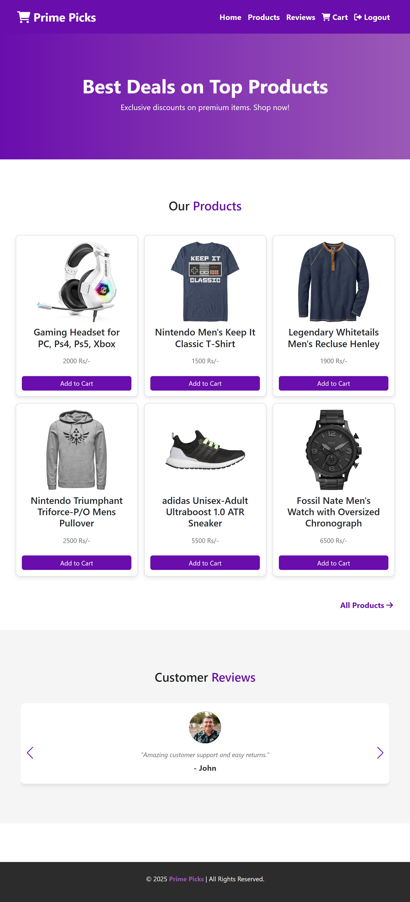
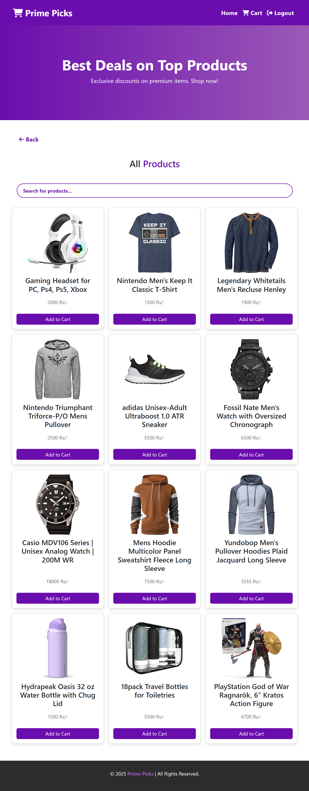
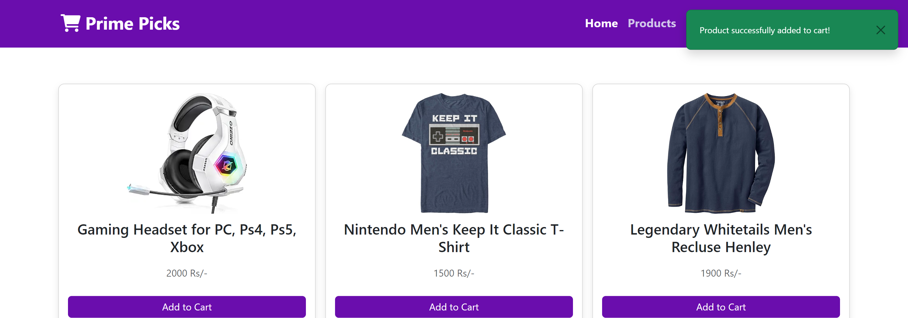
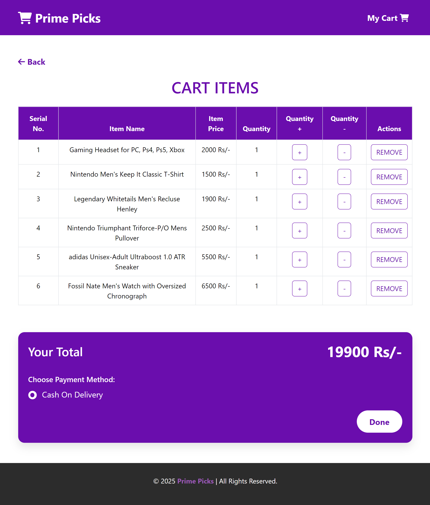
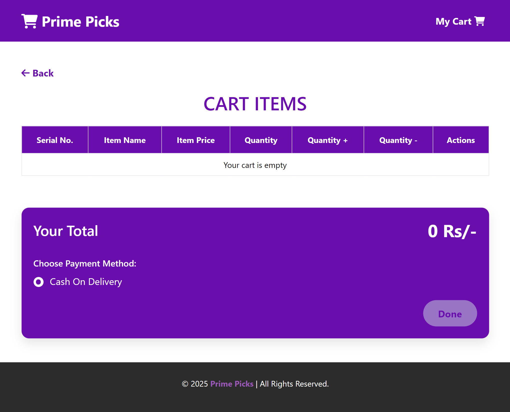
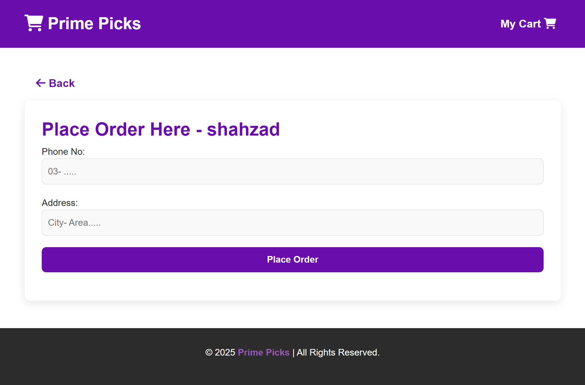
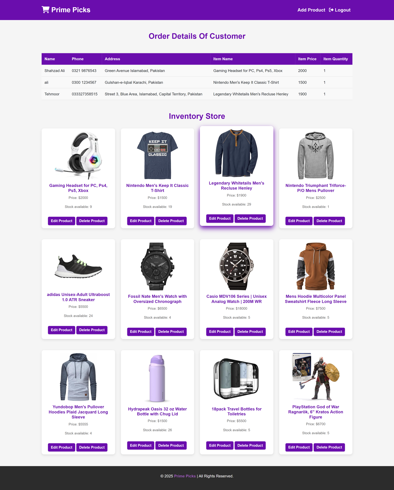
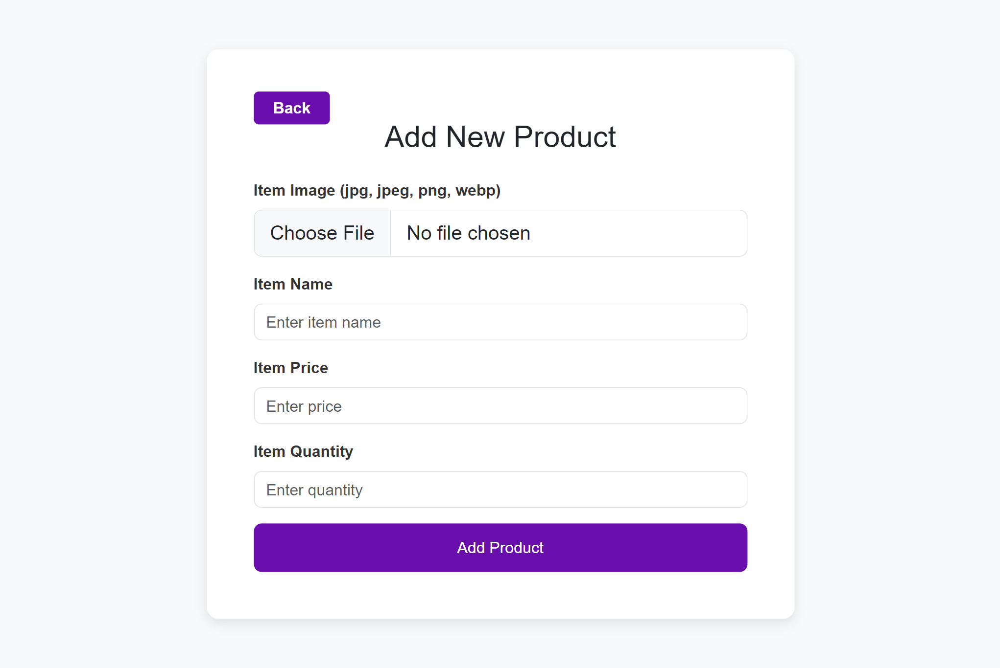
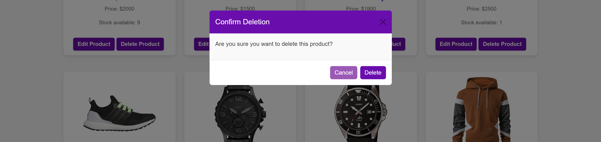

# Prime Picks - E-Commerce Platform

**Prime Picks** is an e-commerce platform built using **Laravel** for the frontend/backend and **MySQL** for data storage. The platform offers a variety of products with an intuitive admin dashboard, secure login, and smooth order management system.

### Table of Contents

- [Project Overview](#project-overview)
- [Features](#features)
- [Installation](#installation)
- [Technologies Used](#technologies-used)
- [Conclusion](#conclusion)


### Project Overview

Prime Picks is a full-featured e-commerce platform designed to make managing online product sales easy for admins and intuitive for customers. Customers can browse and purchase products, manage their cart, and place orders. On the other hand, the admin can add, edit, and delete products, as well as process customer orders.

This project integrates **Laravel** (a popular PHP framework) for the frontend/backend and **MySQL** for the database to handle user data, product details, and orders.


### Features

**1. Customer Interface:**
   - Browse through a wide range of products
   - Add products to the cart
   - Modify cart items (adjust quantities or remove items)
   - Place orders with payment options

   ### Screenshots

   ###  **Home Page**
   The home page shows available products and customer reviews.
   

   ###  **Product Page**
   The product page shows all available products with prices and options to add them to the cart.
   
   
   ###  **Add To Cart**
   
   
   ###  **Cart Management**
   Customers can view and manage their cart before checking out.
   
   
   Empty Cart looks like this.
   

   ###  **Order Processing**
   This is an order placement page, allowing customers to enter their phone number and address to complete the order process.
   
 
 
**2. Admin Panel:**
   - Admin login with secure authentication
   - Manage products (add, edit, delete)
   - View inventory and stock availability
   - Manage customer orders (view details)
   
   ### Screenshots
   
   ###  **Admin Login**
   - Access the admin page using default credentials:
     - Username: `admin`
     - Password: `admin`
   - To update the admin username or password, modify the `admin_login` function in the `PrimePicks` controller.

   
   
   ###  **Admin Dashboard**
   The admin dashboard provides access to inventory management, product updates, and order handling.
   
   
   ### **Product Management:**
   - Admin can upload product images and details (price, stock, and description)
   - Product image, price, name, and availability can be updated
   - Confirmation prompt before deleting any product
   
   
   **Add New Product**

   
   
   **Edit Product**

      
   
   **Delete Product**

   


### Installation

To run this project locally, follow these steps:

1. **Clone the repository:**
   ```bash
   git clone https://github.com/Shahzad-Ali-44/Prime-Picks-E-Commerce-Platform.git
   ```

2. **Navigate into the project directory:**
   ```bash
   cd Prime-Picks-E-Commerce-Platform
   ```

3. **Install dependencies:**
   Ensure you have **Composer** installed. If you do not have it, [download Composer](https://getcomposer.org/).
   Run the following command to install PHP dependencies:
   ```bash
   composer install
   ```

4. **Set up the environment file:**
   Copy the `.env.example` file to `.env`:
   ```bash
   cp .env.example .env
   ```

5. **Generate the application key:**
   Run the following command to generate an application key:
   ```bash
   php artisan key:generate
   ```

6. **Set up your MySQL Database:**
   - Create a new database in MySQL(primepicks).
   - Update the `.env` file with your database credentials:
     ```
     DB_CONNECTION=mysql
     DB_HOST=127.0.0.1
     DB_PORT=3306
     DB_DATABASE=primepicks
     DB_USERNAME=your_database_user
     DB_PASSWORD=your_database_password
     ```

7. **Migrate the database:**
   Run the following command to migrate the necessary database tables:
   ```bash
   php artisan migrate
   ```
8. **Run Storage Link Command**:
   ```bash
   php artisan storage:link
   ```
   This command creates a symbolic link between the `storage` directory and the `public` directory, ensuring file uploads work correctly.

9. **Run the application:**
   Finally, serve the application using the Laravel development server:
   ```bash
   php artisan serve
   ```

10. Open your browser and visit `http://localhost:8000` to access the application.


### Technologies Used

- **Frontend:**
  - HTML, CSS, JavaScript jQuery
  - Bootstrap for responsive design

- **Backend:**
  - PHP
  - Laravel Framework for handling the backend

- **Database:**
  - MySQL (used to store products, orders, and user data)

### Contribution Guidelines

1. Fork the repository.
2. Create a new branch for your feature/bug fix:
   ```bash
   git checkout -b feature-name
   ```
3. Commit your changes and push to your branch:
   ```bash
   git push origin feature-name
   ```
4. Open a pull request and describe your changes.

### License
This project is licensed under the [MIT License](LICENSE).


### Conclusion 
**Prime Picks** is a feature-rich e-commerce platform built with **Laravel** and **MySQL**, providing both customers and admins an easy-to-use system for managing and purchasing products. The project highlights full-stack web development, incorporating backend logic, frontend design, and user authentication.

### Acknowledgements
- Laravel framework
- Bootstrap for responsive design

Enjoy using **Prime Picks** and feel free to contribute!